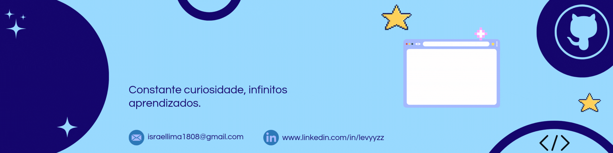

#

💻Sou estudante de Engenharia de Software | Apaixonado por programação e novas tecnologias | Sempre explorando projetos em HTML, CSS, JavaScript, Python e mais | Em busca de aprendizado contínuo e desafios que me façam crescer 🚀

#
###

<h3 align="left">Connect with me!</h3>

<h3 align="left">My Stack </h3>

  
  
  
  
  
  
  
  
  
  
  
  
  
  
  
          

  
#

  <h3>* GitHub Stats *</h3>
   
  

  
  

#

<picture align="center">
  <source media="(prefers-color-scheme: dark)" srcset="https://raw.githubusercontent.com/mari4souza/mari4souza/output/github-contribution-grid-snake-dark.svg">
  <source media="(prefers-color-scheme: light)" srcset="https://raw.githubusercontent.com/mari4souza/mari4souza/output/github-contribution-grid-snake-dark.svg">
  
</picture>
